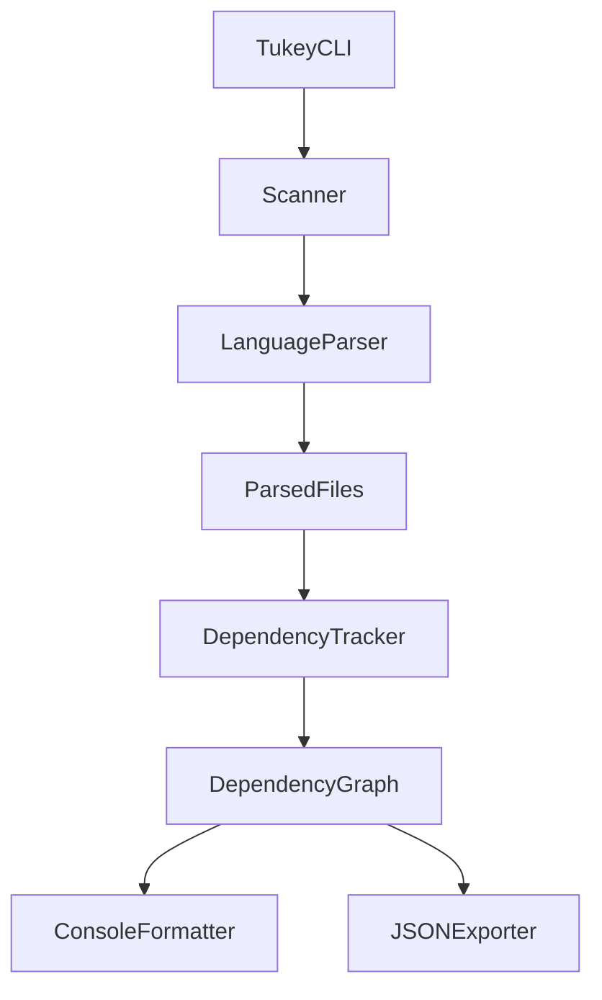

## Tukey – AGENTS Guide

This document is for **AI agents** (and future maintainers) working on Tukey.  
It explains the **project structure**, the **PHP analysis pipeline**, how current behavior aligns with the **features in `README.md`**, and where to plug in new languages or outputs safely.

---

### 1. Purpose and High‑Level Overview

Tukey is a **high‑performance static analysis tool** that:

- **Maps code dependencies** between functions, methods, classes, and files.
- Highlights **complex / “hot” elements** in the graph.
- Surfaces **dead or orphaned code** (elements unused by the rest of the project).
- Emits a **console summary** and optional **JSON export** suitable for CI or further tooling.

The initial implementation is **PHP‑first**, but the architecture is **language‑agnostic** via a `LanguageParser` interface and a parser registry.

AI agents should treat this file as the **source of truth** for how to extend Tukey (new analyzers, outputs, or CLI behavior) without breaking existing contracts.

---

### 2. Repository Layout and Responsibilities

At a high level:

- **`cmd/tukey`**  
  - CLI entrypoint (`main.go`).  
  - Parses flags, merges config, orchestrates scanning, parsing, analysis, and output.  
  - If you change user‑facing behavior or add flags, it usually happens here.

- **`internal/lang`**  
  - Language‑specific parsers (currently only PHP).  
  - `php.go` implements `LanguageParser` and self‑registers via `parser.Register` in `init()`.  
  - Add new language parsers here and keep them **stateless** except for shared regex or configuration.

- **`internal/parser`**  
  - Defines the **`LanguageParser` interface** and manages the parser registry.  
  - `parser.Get(language)` is called from `cmd/tukey` to select the implementation.  
  - No language‑specific logic belongs here.

- **`internal/scanner`**  
  - Discovers files to analyze under a root directory.  
  - Handles **exclude directories** (e.g. `vendor`, `.git`, `node_modules`, plus user‑configured ones).  
  - Filters by **file extensions** configured from the selected `LanguageParser`.

- **`internal/models`**  
  - Core data types used across the pipeline:  
    - `FileInfo`: basic file metadata.  
    - `CodeElement`: a single declared item (class, function, method, property, constant).  
    - `ParsedFile`: all elements and usage extracted from one file.  
    - `UsageElement`: a reference from one element/context to another (e.g. function call, method call, instantiation).  
    - `DependencyNode`, `DependencyRef`, `DependencyGraph`: the graph representation of the project.  
    - `AnalysisResult`: container passed to output layers (console and JSON).  
  - Also owns the **concurrency helpers** (`DependencyGraph.Lock/RLock`, etc.).

- **`internal/analyzer`**  
  - `DependencyTracker` turns `ParsedFile` data into a `DependencyGraph`.  
  - Responsibilities:  
    - Create graph nodes for each `CodeElement`.  
    - Maintain indexes (`nodeIndex`, `namespaceMap`) so usages can be resolved to targets.  
    - Build directed edges for calls, instantiations, and imports.  
    - Compute **complexity scores**, discover **orphans**, and identify **hotspots**.  
  - Does **not** own user‑facing formatting; it should stay data‑oriented.

- **`pkg/output`**  
  - User‑facing renderers:  
    - `ConsoleFormatter`: prints the summary and detailed reports to stdout.  
    - `JSONExporter`: exports structured analysis data (graph and metadata) to a file.  
  - New presentation/reporting features should be implemented here, driven by `AnalysisResult`.

- **`internal/config`**  
  - Handles loading `.tukey.yml` / `.tukey.yaml` / `.tukey.json` from the project root.  
  - Merges file‑based config with CLI flags (CLI has priority).  
  - Configuration values include `language`, `excludeDirs`, `outputFile`, `verbose`.

- **`internal/progress`**  
  - Spinners and progress bars used during scanning and parsing.  
  - Pure UX layer; do not put analysis logic here.

- **`testdata`**  
  - Sample PHP project and fixtures used for tests and local experimentation.  
  - Safe sandbox for introducing new patterns you want the analyzer to handle.

---

### 3. End‑to‑End Execution Flow

The typical run is:

1. **CLI & Config (`cmd/tukey`)**
   - Parse CLI flags (root path, `--verbose`, `--output`, `--exclude`, `--language`).
   - Load optional project config via `internal/config.LoadConfig`.
   - Merge configs with **CLI taking precedence** (see `mergeConfigs` in `main.go`).
   - Determine the active language (default: `php`).

2. **File Scanning (`internal/scanner`)**
   - Instantiate `Scanner` with the root path.  
   - Configure extensions from the chosen `LanguageParser.FileExtensions()`.  
   - Add default and user‑specified exclude directories.  
   - Walk the filesystem, collecting `FileInfo` for each matching file.

3. **Parsing (`internal/lang`, `internal/parser`)**
   - Use `parser.Get(language)` to retrieve the registered `LanguageParser`.  
   - Call `LanguageParser.ProcessFiles`, which:  
     - Parses files (for PHP, concurrently with a semaphore‑limited goroutine pool).  
     - Produces a slice of `ParsedFile` structs.

4. **Analysis (`internal/analyzer`)**
   - Create `DependencyTracker`.  
   - Call `BuildDependencyGraph(parsedFiles)` to produce a `DependencyGraph`.  
   - Tracker:  
     - Builds all nodes and indexes.  
     - Connects dependencies from usages and imports.  
     - Computes complexity scores and identifies orphans and hotspots.

5. **Output (`pkg/output`)**
   - Build an `AnalysisResult` that packages the graph, parsed files, totals, and timing.  
   - Use `ConsoleFormatter.PrintSummary(result, verbose)` to print the console summary.  
   - If `--output` is set (or defaults in verbose mode), use `JSONExporter.Export(result, filename)` to persist the analysis.

Pipeline diagram:

---

### 4. PHP Analyzer Details (`internal/lang/php.go`)

The PHP analyzer is **regex‑driven**, not a full PHP AST. It focuses on the constructs needed to build a useful dependency graph and usage map.

- **Namespace and imports**
  - Tracks a file‑level `Namespace` via `namespacePattern`.  
  - Collects `use` statements into `ParsedFile.Uses` (full import paths).

- **Definitions → `CodeElement`**
  - **Classes** (`classPattern`):  
    - Records class name, namespace, `IsAbstract`, and definition line.  
    - Used to construct `DependencyNode`s of type `"class"`.
  - **Methods** (`methodPattern`, when inside a class):  
    - Captures name, visibility, `IsStatic`, `IsAbstract`, parameters (names only), return type.  
    - Context fields: `Namespace`, `ClassName`, definition line, file path.
  - **Standalone functions** (`functionPattern`, when not in a class):  
    - Captures name, parameters, and optional return type.  
    - Recorded as `CodeElement` of type `"function"`.
  - **Properties** (`propertyPattern`):  
    - Visibility, `IsStatic`, name, class context, definition line, file.  
    - Recorded as type `"property"`.
  - **Constants** (`constantPattern`):  
    - Supports both global and class constants with visibility.  
    - Recorded as type `"constant"`.

- **Usage → `UsageElement`**
  - For each non‑comment, non‑empty line, PHP parser records usage patterns with `Context` = current method or class:  
    - **Static calls** (`Class::member`): type `"static_call"`.  
    - **Method calls** (`$obj->method` or property access): type `"method_call"`.  
    - **Instantiations** (`new Class` or fully‑qualified): type `"instantiation"`.  
    - **Global function calls** (`funcName(`): type `"function_call"`, **after filtering**:  
      - Skips when line includes `->` or `::` (to avoid misclassifying methods and static calls).  
      - Skips built‑in PHP functions and common Laravel helpers via `isBuiltinFunction`.  
      - Skips definition lines (`function X` / `class X`) to avoid self‑references.

- **Concurrency**
  - `PHPParser.ProcessFiles` processes files in parallel, bounded by a semaphore.  
  - Each parsed file increments a shared progress bar, even on parse errors.  
  - Errors are logged but do **not** abort the entire analysis.

When extending PHP support (e.g., better generics, traits, or more nuanced method resolution), keep the **regex approach simple** and focused on what the dependency graph needs.

---

### 5. Dependency Analysis and Metrics (`internal/analyzer/dependency_tracker.go`)

`DependencyTracker` converts parsed elements and usage into a scored graph:

- **Node creation and indexing (`createNodes`)**
  - For each `CodeElement` in all `ParsedFile`s, it creates a `DependencyNode` with ID:  
    - `"<type>:<fullyQualifiedName>:<lineNumber>"` (e.g. `class:App\\Models\\User:8`).  
  - Fills: `Name`, `Type`, `File`, `Namespace`, `ClassName`, `Line`, empty `Dependencies` and `Dependents`.  
  - Computes a **base complexity score** via `calculateComplexityScore`:
    - `class`: base 5, +2 if abstract.  
    - `method` / `function`: base 3, +1 per parameter, +1 if static, +2 if abstract.  
    - `property`: base 2, +1 if static.
  - Maintains several indexes:  
    - `nodeIndex[fullName] = nodeID` (always).  
    - `nodeIndex[shortName] = nodeID` when unambiguous; removed on conflicts.  
    - `namespaceMap[classShortName] = fullName` for disambiguation.

- **Relationship building (`buildRelationships`)**
  - For each `ParsedFile`:  
    - `processFileUsage` iterates `UsageElement`s, looks up a **source node** by matching `usage.Context` to node name or class name in the same file, and resolves **target nodes** via `findTargetNode`.  
    - `processImports` adds `"imports"`‑type edges from classes to imported items if they exist in `nodeIndex`.
  - `addDependencyRef` updates both `source.Dependencies` and `target.Dependents` with counts and line information, and increments `TotalEdges`. Self‑dependencies are ignored.

- **Metrics and patterns (`calculateMetrics`, `identifyPatterns`)**
  - Enhances each node’s score with:  
    - `+len(Dependencies)` and `+2*len(Dependents)` (dependents are weighted more heavily).
  - Builds three key views used by outputs:
    - **HighlyDepended**: sorted by number of dependents (top N).  
    - **Orphans**: nodes with **no** dependencies and **no** dependents.  
    - **ComplexNodes**: sorted by final score (top N).

These metrics directly back the console summary and JSON export and are central to **complexity mapping** and **dead code detection**.

---

### 6. README Features vs. Current Implementation

From `README.md`:

| Feature                     | Status                     | Notes |
| --------------------------- | -------------------------- | ----- |
| **Deep Code Analysis**     | **Implemented (PHP)**      | PHP parser extracts classes, methods, functions, properties, constants, namespaces, imports, and usage patterns into `ParsedFile` and `CodeElement`. |
| **Dependency Mapping**     | **Implemented**            | `DependencyTracker` builds a `DependencyGraph` with `Dependencies` and `Dependents` for each node and tracks imports and call relations. |
| **Complexity Metrics**     | **Implemented (heuristic)** | Node scores combine element type, parameters, static/abstract flags, and graph degree; top complex nodes are exposed as `ComplexNodes`. |
| **Usage Tracking**         | **Implemented & surfaced** | PHP parser records `UsageElement`s; verbose console output shows a **Function Usage Report** grouping calls by function and file, matching the README example. |
| **Dead Code Detection**    | **Implemented (orphans)**  | Nodes with zero dependencies and dependents are listed as **Orphaned Elements** in the console summary. |
| **High Performance**       | **Implemented**            | Concurrent parsing with a bounded worker pool; scanning and analysis are optimized for large trees. |
| **Language‑agnostic design** | **Implemented (PHP only today)** | `LanguageParser` interface and parser registry support plugging in additional languages without changing `cmd/tukey`. |

**Important note for agents:**  
The function usage report used to exist only in `internal/analyzer.DependencyTracker.PrintFunctionUsageReport`.  
It is now implemented in **`pkg/output.ConsoleFormatter.PrintFunctionUsageReport`**, driven by `AnalysisResult.ParsedFiles` and the `DependencyGraph`, so that CLI output aligns with README examples.

---

### 7. Function Usage Reporting – Behavior and Expectations

Verbose mode (`-v` / `--verbose`) prints a **Function Usage Report** similar to the README:

- Groups by **function name**.  
- For each function:  
  - Shows its definition file and line if defined in the project (using `DependencyNode` of type `"function"`).  
  - Lists **total call count**.  
  - Groups call sites by file; within each file, call sites are ordered by line.  
  - Includes optional context (enclosing function/method name) when available.

Implementation details:

- The report is generated entirely in `pkg/output/console.go` by:  
  - Scanning `AnalysisResult.ParsedFiles[].Usage` for entries with `Type == "function_call"`.  
  - Filtering is already applied at parsing time (builtins and common Laravel helpers removed).  
  - Looking up the definition node in `result.Graph.Nodes` where `node.Type == "function"` and `node.Name` matches.

Agents adding new usage kinds or changing what is considered a “custom function” should keep this contract in mind so the report remains accurate and readable.

---

### 8. Extension Points and Guidelines for Agents

#### 8.1 Adding a New Language Parser

To support a new language:

- **Implement `LanguageParser`** in a new file under `internal/lang` (e.g. `go.go`, `ts.go`):  
  - `ProcessFiles(files []models.FileInfo, progressBar *progress.ProgressBar) ([]*models.ParsedFile, error)`  
  - `Language() string` – unique language key (e.g. `"go"`, `"ts"`).  
  - `FileExtensions() []string` – file extensions to scan for.

- **Register the parser** in an `init()` function:

  - Call `parser.Register(NewYourParser())`.  
  - Ensure the `Language()` string matches what users will pass via `--language`.

- **Populate core models consistently**:

  - Fill `ParsedFile.Elements` with appropriate `CodeElement`s representing the language’s classes, functions, methods, etc.  
  - Populate `ParsedFile.Usage` with `UsageElement`s that mirror the semantics of:
    - `"static_call"`, `"method_call"`, `"instantiation"`, `"function_call"`, or any new types you introduce.  
  - Maintain `UsageElement.Context` such that analyzer can associate usages back to the correct source node.

- **Coordinate with the scanner**:

  - The CLI will call `fileScanner.SetExtensions(p.FileExtensions())`.  
  - Ensure your `FileExtensions` list is complete for the target language (e.g. `.go`, `.ts`, `.tsx`).

#### 8.2 Extending Output and Reports

- Prefer **adding behavior in `pkg/output`** and plumbing in any required data via `AnalysisResult` rather than calling `fmt.Printf` in deeper layers.
- `ConsoleFormatter.PrintSummary` is the main entry for console output; verbose mode is where detailed reports (like the function usage report) belong.
- `JSONExporter` currently exports:
  - The `DependencyGraph`.  
  - Basic totals and processing time metadata.

If you need new JSON fields (e.g. to export function usage summaries or additional metrics), update `models.AnalysisResult` and the anonymous struct in `pkg/output/json.go`. Keep additions **backward compatible** when possible.

#### 8.3 Working with the Dependency Graph

- Treat `DependencyNode.ID` as an **opaque, stable identifier**. Do not change its format lightly; tests, outputs, and downstream tools may rely on it.
- Use the graph’s lock helpers when mutating:

  - `DependencyGraph.Lock/Unlock` for writes.  
  - `DependencyGraph.RLock/RUnlock` for read‑only traversals that might happen concurrently.

- When adding new edge types, use the existing `DependencyRef` structure and keep `Type` strings descriptive but concise (e.g. `"imports"`, `"calls"`, `"instantiates"`).

#### 8.4 Safety and Invariants

- Do **not** move user‑facing printing into `internal/analyzer` or `internal/lang` – those should remain primarily data‑oriented.  
- Avoid tight coupling between a specific language parser and the analyzer; analysis should use only `ParsedFile`, `CodeElement`, and `UsageElement` abstractions.  
- Maintain reasonable defaults:
  - PHP should remain the default `Language` if none is specified.  
  - Exclude directories should continue to filter out vendor and tool directories by default.

---

### 9. How Agents Should Approach Changes

When making non‑trivial changes:

- **Start from the flow in this document** – determine which stage you are modifying (scanner, parser, analyzer, output).  
- Keep **tests** in sync:
  - Add fixtures under `testdata` where appropriate.  
  - Extend or add tests in `internal/lang`, `internal/analyzer`, `pkg/output`, etc.
- Preserve **backwards‑compatible outputs** where possible, especially for CI users relying on JSON or parsing console logs.

Following these guidelines will help maintain Tukey’s goal: a **fast, language‑agnostic map** of large codebases that highlights **dependencies, complexity, and dead code** with minimal friction for users.

