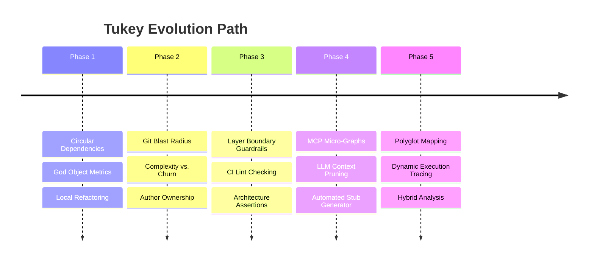

# Tukey Development Roadmap

This document outlines the planned evolutionary phases for Tukey, expanding it from a high-performance PHP static dependency analyzer into a comprehensive codebase intelligence engine for both human developers and AI agents.

---

## 🗺️ High-Level Vision
Tukey's ultimate goal is to provide a **lightweight, lightning-fast, zero-infrastructure codebase map** that helps developers and agentic workflows navigate, refactor, and safeguard complex software architectures.



---

## 📂 Phases and Deliverables

### 🛑 Phase 1: Deep Static & Refactoring Intelligence
*Strengthen the core static analysis engine with deeper metrics and refactoring helpers.*

- [x] **Circular Dependency Detection**
  - **Description:** Implement Tarjan's or Johnson's algorithm to trace dependency cycles (e.g., $A \to B \to C \to A$) in the dependency graph.
  - **Complexity:** Medium
  - **Proposed Implementation:** Add a `pkg/analyzer/cycles.go` file to analyze the resolved `DependencyGraph`.
- [ ] **"God Object" & Code Smell Heuristics**
  - **Description:** Identify highly coupled, low-cohesion classes. Combine file size, method count, parameter count, and graph degree (in/out-degree) to flag candidate god classes.
  - **Complexity:** Low
  - **Proposed Implementation:** Extend the complexity scoring rules in `internal/analyzer/dependency_tracker.go`.
- [ ] **Automated Dead Code Pruning Suggestions**
  - **Description:** Provide safe-to-delete action recommendations for orphans or private methods/properties that are completely unused, printing them clearly in CLI summaries or JSON exports.
  - **Complexity:** Low

---

### 📈 Phase 2: Version Control (Git) Integration
*Overlay repository history over the structural graph to identify real-world risk, stability, and ownership.*

- [ ] **Git Churn vs. Complexity Mapping**
  - **Description:** Parse git log history to count edit frequency (churn) per file over the last 3–6 months. Map this against static complexity scores to locate highly modified, highly complex danger zones.
  - **Complexity:** Medium
  - **Proposed Implementation:** Create `internal/git/churn.go` executing lightweight git commands or using a Go git library.
- [ ] **Refactoring Blast Radius & Change Impact Analysis**
  - **Description:** Provide a command (e.g., `tukey impact --branch main`) that analyzes currently changed files in the working directory/branch, identifying all upstream dependents that could be affected by the modifications.
  - **Complexity:** Medium
- [ ] **Bus Factor & Knowledge Mapping**
  - **Description:** Cross-reference `git blame` data with complex or orphaned files to highlight modules whose primary authors are no longer active contributors.
  - **Complexity:** Medium
- [x] **Architectural & Metric Regression Detection (`--compare`)**
  - **Description:** Compare the active codebase against a baseline JSON analysis file to track added/deleted elements, resolved/new orphaned dead code, and complexity regressions.
  - **Complexity:** Medium
  - **Proposed Implementation:** Compare nodes by a line-number independent stable signature (Type + Scope + Name) to prevent false alerts on line-number shifts.

---

### 🛡️ Phase 3: Architectural Layer & Boundary Guardrails
*Prevent architectural drift and enforce clean architecture rules programmatically.*

- [x] **Boundary Rules Engine (`tukey check`)**
  - **Description:** Define a structured configuration schema in `.tukey.yml` allowing developers to declare layer boundaries (e.g., Domain, Application, Infrastructure) and assert dependency rules.
  - **Complexity:** Medium
  - **Proposed Implementation:** Extend `internal/config` to parse boundary rules, and add `pkg/guard/guardrails.go` to assert these rules against the generated `DependencyGraph`.
  - **Example Rule Configuration:**
    ```yaml
    architecture:
      layers:
        - name: Domain
          path: internal/domain
        - name: Infrastructure
          path: internal/infra
      rules:
        - Domain cannot_depend_on [Infrastructure]
    ```
- [x] **CI/CD Integration and Exit Codes**
  - **Description:** Implement a strict mode for CI systems. Tukey will exit with non-zero exit codes if circular dependencies, boundary violations, or new orphaned elements are introduced.
  - **Complexity:** Low

---

### 🤖 Phase 4: AI Agent Context Pruning & Tooling
*Optimize Tukey as a machine-readable brain for agentic AI workflows (e.g., Gemini, Claude, Cursor).*

- [x] **MCP Micro-Graph Tool (`tukey_get_localized_context`)**
  - **Description:** Add an MCP tool that accepts a target symbol (e.g., `OrderController::checkout`) and returns a minimized sub-graph containing only immediate dependencies/dependents within $N$ steps. This prevents stuffing entire codebases into LLM context windows.
  - **Complexity:** Low
  - **Proposed Implementation:** Add a query method in `pkg/query/query.go` and expose it as a tool in the MCP server.
- [ ] **Automated Test Mock & Stub Generator**
  - **Description:** Generate boilerplate mocks/stubs for external dependencies of a class, based on Tukey's dependency mapping, facilitating instant mock creation for unit testing.
  - **Complexity:** High

---

### 🌐 Phase 5: Polyglot Mapping & Hybrid Runtime Traces
*Expand Tukey beyond single-language static rules to address full-stack, dynamic, modern web apps.*

- [ ] **Multi-Language Parser Expansion (Go, TypeScript)**
  - **Description:** Add new `LanguageParser` implementations for TypeScript/JavaScript and Go to map polyglot codebases.
  - **Complexity:** High
- [ ] **Full-Stack Boundary Bridging**
  - **Description:** Trace boundaries between frontend single-page apps (TypeScript) and backend APIs (PHP/Go). Match fetch/axios API calls with backend router registrations to create a seamless end-to-end graph.
  - **Complexity:** High
- [ ] **Hybrid Dynamic Execution Analysis**
  - **Description:** Allow Tukey to ingest execution logs or tracing data (e.g., Xdebug profile format, OpenTelemetry trace spans) to resolve dynamic calls, dependency injection mappings, or runtime method dispatches that static analysis cannot easily resolve.
  - **Complexity:** High

---

## 💡 Quality-of-Life (QoL) Enhancements
*Small, high-impact improvements to boost developer experience and daily usage.*

- [ ] **Ignore Directives/Annotations (`@tukey-ignore`)**
  - **Description:** Allow developers to suppress false positives (like framework entry points, event handlers, or dynamic magic methods) from being flagged as orphans by adding simple comment tags (e.g. `// @tukey-ignore-orphan`).
  - **Complexity:** Low
- [ ] **Export to Graphviz `.dot` or ASCII Tree**
  - **Description:** Provide a simple command-line flag (`--format dot` or `--format tree`) to export a visual graph schema or ASCII-art tree directly in the terminal for quick manual inspections.
  - **Complexity:** Low
- [ ] **Orphan Age Overlay**
  - **Description:** Cross-reference orphan elements with Git metadata to display how long ago they were last modified (e.g., "Modified 3 days ago" vs "Modified 2 years ago"). This helps teams easily distinguish active work-in-progress from true stale dead code.
  - **Complexity:** Medium
- [x] **Performance Benchmarking Mode (`--benchmark`)**
  - **Description:** Add a built-in benchmark flag to measure file processing speed, goroutine allocation, memory footprint, and throughput (lines of code parsed per second).
  - **Complexity:** Low
  - **Planned Next Steps / Refinements:**
    - [ ] **Telemetry Export:** Include benchmark timing and memory metrics in the JSON export (`--output`) to track CI pipeline performance over time.
    - [ ] **Bottleneck Analysis:** Report the top $N$ slowest files during parsing to help identify files causing high execution time.
    - [ ] **Regression Detection:** Compare execution times against a previous analysis result file if one is provided.

---

## 📈 Progress Tracking & Contribution

To update or check on implementation progress:
1. Open a GitHub Issue linking to the relevant roadmap item.
2. Maintain backward compatibility in the `tukey-results.json` schema when adding new fields or metadata.
3. Ensure all new analysis features have unit tests covered under `make test`.
